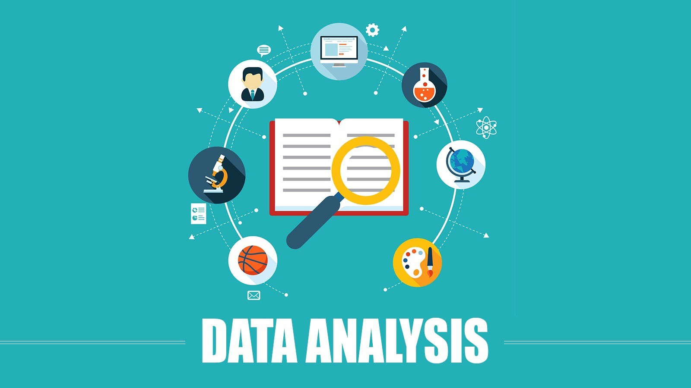

  <h1 align="center"><b>Hi, I am Abdelrahman Hassan! </h1>

<h2 align="center">Social Media Accounts:</h2>

&nbsp;
&nbsp;
&nbsp;

 

Biomedical Engineer, Python Developer and enthusiast in the field of ML and AI, Data Analyst, Web Developer
 

<h1 align="center">My favorite projects 💻</h1>
 

  
  
 
  
  
  
  

 

<h1 align="center">About me 😇</h1>
 

Biomedical Engineer from Cairo University Faculty Of Engineering.  
I started my career in programming since 2018. 
I learned C++ and java and this was my first step to dive into programming.  
Now I am a Python Developer and enthusiast in the field of Machine Learning and Artificial Intelligence.  
So I started Learning Data analysis and yet I finished a Nano Degree from Udacity.  
I also Learned Web Development and got a course to become a full-stack web developer, and for my interest in Mobile applications, I learned to Flutter and build some apps. 

 
 

<h3 align="center"> Languages and Tools</h3>

 

 

 <em><b>I love connecting with different people</b> so if you want to say <b>hi, I'll be happy to meet you more!</b> 😊</em>

 

 

