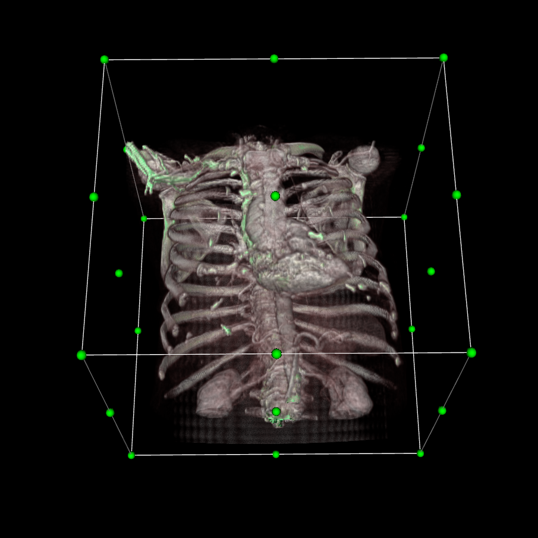

  <h1 align="center"><b>Hi, I am Abdelrahman Hassan! </h1>

<h2 align="center">Social Media Accounts:</h2>

&nbsp;
&nbsp;
&nbsp;

  
  
My Youtube Channel:

  <a href="https://www.youtube.com/channel/UCd_rPbpKH8iRGOG-LOg-jkg">
Magara
</a>

  
My Personal Portfolio:

  <a href="https://portfolio-and.herokuapp.com/">
Portfolio
</a>

Software Developer-Full Stack Web Developer-Interested in Machine Learning and AI, and how to apply this in the medical field to solve severe medical problems.
 

<h1 align="center">My favorite projects 💻</h1>
 

  
  
  

 

  

  

 

<h1 align="center">About me 😇</h1>
 

Biomedical Engineer at Cairo University Faculty Of Engineering. 
I started my career in programming since 2018. 
I learned C++ and java and this was my first step to dive into programming. 
I learned python after that and managed to perform some easy and complex tasks.  
I also Learned Web Development and got a course to become a full-stack web developer, and for my interest in Mobile applications, I learned to Flutter and build some apps. 

 
 

<h1 align="center"> Languages and Tools</h1>

 

 

 

 
  Profile Views  
  

